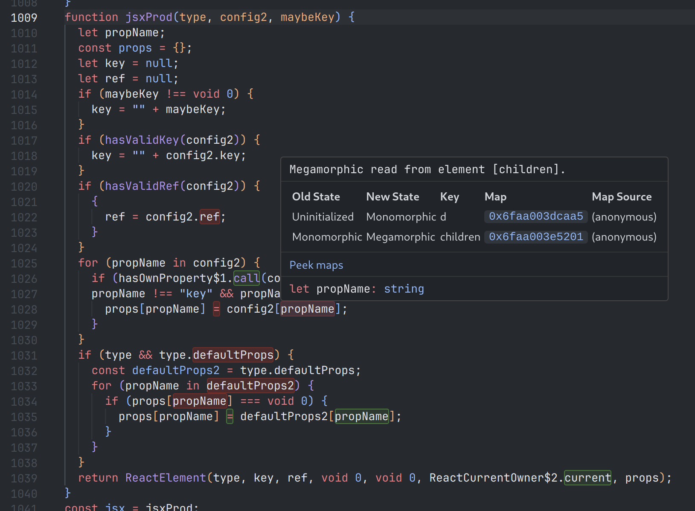

# babel-plugin-fast-jsx

> Inline React `jsxProd()` calls

- [Usage](#usage)
- [Why?](#why)
- [FAQ](#faq)

## Usage

### Vite

This should run on all files, including `node_modules`.

```javascript
import { defineConfig } from 'vite'
import react from '@vitejs/plugin-react'
import babel from 'vite-plugin-babel'

export default defineConfig({
  plugins: [
    react(),
    babel({
      filter: /\.(jsx?|tsx?)/,
      babelConfig: {
        plugins: [
          ['babel-plugin-fast-jsx', {
            useSpread: false,  /* Use `{ ...defaultProps, a: 1, b: 2 }` */
            useBuiltIns: true, /* Use `Object.assign({}, defaultProps, { a: 1, b: 2 })` */
          }],
          // You might want to add this one, if you don't support Object.assign or spread:
          // '@babel/plugin-transform-object-rest-spread',
        ]
      }
    })
  ],
})
```

### Webpack

I haven't tested, but it should be as easy as adding a babel-loader transform with the same config as the vite config above.

## Why

JSX in React normally desugars to something like this:

```javascript.jsx
// from this
function Component({ children }) {
  return (
    <div ref={handleRef} key='component'>
      {children}
    </div>
  )
}

// to this
import { jsx as _jsx } from 'react/jsx-runtime';
function Component({ children }) {
  return _jsx('div', {
    ref: handleRef,
    key: 'component',
    children: children,
  })
}
```

The problem is that `jsx()` is *slow*, because it needs to clone the props you pass in to extract the `key` and `ref`, and pass them separately to its internal builder function. But is also slow because it needs to handle `defaultProps`, and because it gets passed objects of all forms and shapes, which makes javascript engines *angry*. Angry because they never know which object shape to expect, and it's hard to optimize those object accesses:



What this plugin does is to inline all those pesky `jsx()` calls, so you're left with this beauty:

```javascript
// To this
import { jsx as _jsx } from 'react/jsx-runtime';
var __react_CurrentOwner = React.__SECRET_INTERNALS_DO_NOT_USE_OR_YOU_WILL_BE_FIRED.ReactCurrentOwner;
var __react_ElementType = Symbol.for("react.element");
function Component({ children }) {
  return {
    $$typeof: __react_ElementType,
    type: 'div',
    ref: handleRef,
    key: 'component',
    props: {
      children: children
    },
    _owner: __react_CurrentOwner.current
  })
}
```

No more unnecessary copies, no more looping through `defaultProps`, no more megamorphic object accesses. It's also smart enough to inline `defaultProps` handling where applicable. That means when the component type is not a string like `'div'`, but a function component:

```javascript
// from this
return _jsx(Component, {
  ref: handleRef,
  key: 'component',
  children: ['text'],
});

// to this
return {
  $$typeof: __react_ElementType,
  type: Component,
  ref: handleRef,
  key: 'component',
  props: Component.defaultProps ?
    _extend({}, Component.defaultProps, { children: ['text'] }) :
    { children: ['text'] },
  _owner: __react_CurrentOwner.current
};
```

Due to limitatations in current JSX conventions, there are however cases that can't be inlined, such as the one below. It uses a destructured `otherProps` object that might contain another `.ref` or `.key`. In those cases, this plugin transforms the call to a slightly more efficient version of `jsxProd()` that considers it has what Rust calls "mutable ownership" over its props argument: it's free to `delete props.ref` instead of copying the object over again.

```javascript
// from this
const component = _jsx(Component, _extends({ ref: handleRef }, otherProps));
// to this (combines _jsx and _extends to avoid copying)
const component = _jsxFromOwnedExtends(Component, null, { ref: handleRef }, otherProps);

// from this
const component = _jsx(Component, { ref: handleRef, ...otherProps });
// to this (mutates its props directly to avoid copying)
const component = _jsxFromOwned(Component, null, { ref: handleRef, ...otherProps });
```

## FAQ

### Is this going to make my app fast?

Only if you see `jsxProd()` (or `q` as it's called in prod at the moment) appear at the top of your devtools profiling results. It could realistically be making up for as low as `0.1%` or as high as `10%` of your runtime. It's really use-case dependent. Start with `React.memo` (or [fastMemo](https://github.com/romgrk/react-fast-memo)) before looking into any of this.

Be aware that all browser devtools are based on sample-based profiling, which takes a sample of your stack at regular intervals. `jsxProd` is the kind of function that could fall between the cracks of those samples, so you might want to use Firefox devtools with a custom sample interval, or Chrome devtools with CPU throttling, to do your profiling.

### Isn't using `__SECRET_INTERNALS_DO_NOT_USE_OR_...` bad?

[It's fine](https://www.npmjs.com/package/its-fine). Imho, React will be hesitant about breaking that API, if they change it they will break some existing alternative renderers such as react-pdf. Proof that giving a stupid name to your internal-only API won't deter devs that need to get stuff done from using it.

### Is this usable in production today?

There is one issue remaining, the plugin is injecting `_jsxFromOwned(Extends)` in every module scope that uses it. With some help from the Babel gods this should be no more than a few hours to fix. Other than that it's pretty much usable. I have tested it with a few major component libraries, it compiles correctly.
